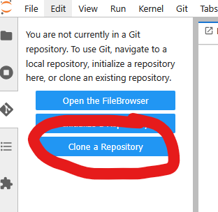

# ARIA_workshop

## Cloning this repository to the JASMIN Notebooks service
1. Open up the JASMIN notebooks server. You might need to start your server if you haven't already.
2. Click the "git" icon on the left hand side of the window. 

3. Click on "Clone a repository"

4. In the pop up window, paste the URI of this repository (`https://github.com/NOC-MSM/ARIA_workshop.git`).

5. Click "Clone". This will download and create a copy of this repository on JASMIN for you, accessed at `~/ARIA_workshop` by default.